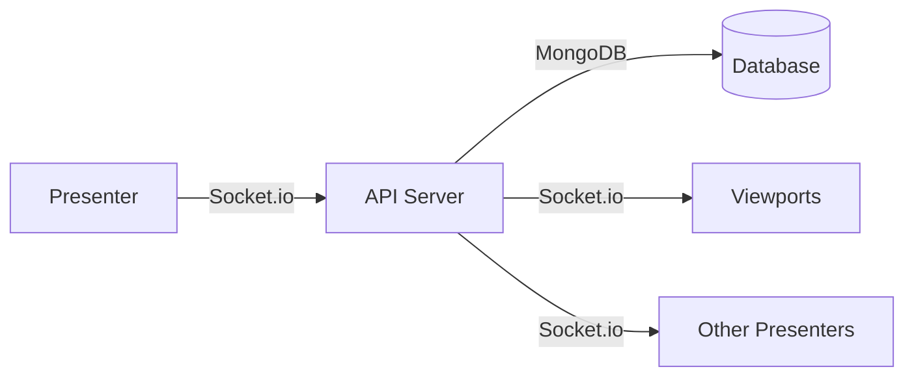

# Architecture

## Tech Stack

| Layer | Technology |
|-------|------------|
| **Frontend** | React (Vite), TanStack Router, TanStack Query, TypeScript, CSS Modules |
| **Backend** | Node.js, Express, Socket.io |
| **Data Fetching** | TanStack Query |
| **Auth & Storage** | Firebase Authentication, Firebase Storage |
| **Deployment** | Firebase Hosting |
| **Bible Data** | Self-hosted database (NIV, KJV, NTR, VDCC) |

---

## Project Structure

```
laudasist/
├── apps/
│   ├── web/                    # React + Vite frontend
│   │   ├── src/
│   │   │   ├── components/
│   │   │   ├── pages/
│   │   │   ├── hooks/
│   │   │   ├── lib/
│   │   │   └── styles/
│   │   └── package.json
│   └── api/                    # Express backend
│       ├── src/
│       │   ├── routes/
│       │   ├── services/
│       │   ├── models/
│       │   ├── socket/
│       │   └── middleware/
│       └── package.json
├── packages/
│   ├── shared/                 # Shared types, utils, chord system
│   └── ui/                     # Shared UI components (Storybook)
├── tests/
│   └── e2e/                    # Playwright E2E tests
├── docs/                       # Documentation
└── package.json                # Monorepo root
```

---

## Real-Time Architecture

### Socket.io Implementation

**Service Room**: `service:{serviceId}`

| Event | Direction | Payload | Description |
|-------|-----------|---------|-------------|
| `join-viewport` | Client→Server | `{ viewportId }` | Join viewport broadcast room |
| `slide-change` | Server→Client | `{ slideData, partId }` | Current slide updated |
| `viewport-update` | Server→Client | `{ theme, layout }` | Viewport settings changed |
| `service-status` | Server→Client | `{ status }` | Service went live/ended |

### Scaling Target (Phase 1)
- ~1,000 concurrent live services
- ~5 viewports per service average
- ~5 viewers per viewport average
- Single server instance with MongoDB

---

## Data Flow



### State Synchronization
- TanStack Query manages client-side cache
- Socket.io events trigger cache invalidation
- Optimistic updates for responsive UI

## PWA, Offline & Sharing (WP-153–160)

- **Shell:** vite-plugin-pwa (Workbox) precaches JS/CSS/HTML/fonts/icons ONLY;
  no runtime caching — the SW must never cache Firestore/API song responses.
  Update flow is an in-app "refresh to update" prompt, never a silent reload.
- **Song data offline:** `@laude/local-library` (IndexedDB) owns it. Two
  retention classes: `pinned` (user download, never auto-evicted) and `cached`
  (recents, LRU cap 20 in `retention.ts`). Only `origin: 'downloaded'` rows are
  eviction candidates; guest-authored content is permanent.
- **Gating:** tuner + solo session run offline; Go Live requires connectivity
  and is disabled with a reason; library/session search fall back to the local
  library (`useOnline`).
- **Sharing:** `navigator.share()` + copy fallback (`ShareButton`); share is
  offered on viewer/presenter links and PUBLIC songs only.
- **Link previews:** the api templates per-route OG/Twitter tags into
  `index.html` for all requests (`apps/api/src/preview/linkPreview.ts`),
  reading relay session state in-process. Icons/OG image are generated by
  `scripts/generate-pwa-assets.mjs`.
