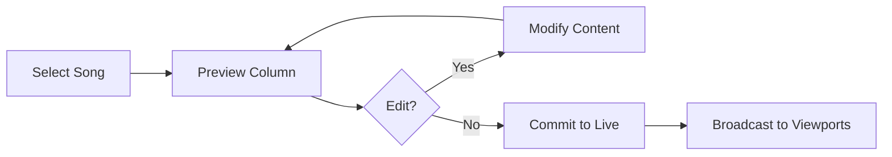

# Live Service

> Full-featured worship service with multi-viewport broadcasting.

## Overview

A **Live Service** is a complete broadcasting experience where presenters control what appears on multiple viewports (audience screens, stage monitors, etc.) in real-time.

---

## Presenter Dashboard

4-column layout for full control:

| Column | Content |
|--------|---------|
| **1 - Library** | Playlist, Bible playlist, Quick search |
| **2 - Preview** | Edit content before committing |
| **3 - Live** | Currently broadcasting content |
| **4 - Viewports** | Monitor all active viewports |

---

## Workflow

---

## Presenter Actions

- **Select content**: Song or Bible verse from playlist/library
- **Preview editing**: Modify slides, add content before committing
- **Commit to Live**: Push preview content to all viewports
- **Navigate slides**: Arrows or click on specific parts
- **Add songs**: Add new songs during live service
- **Viewport control**: Adjust theme, layout, background per viewport

---

## Multi-Presenter Support

- Multiple staff can control the same live service simultaneously
- Changes sync in real-time via Socket.io
- TanStack Query manages state consistency

---

## Access Links

| Type | Access Level |
|------|--------------|
| **View** | Read-only viewport access (guests allowed) |
| **Edit** | Presenter access (requires login) |

- Links can be generated with QR codes
- Links can be revoked if needed
- Optional expiration date

---

## Viewport Types

| Type | Purpose |
|------|---------|
| `audience` | Full screen lyrics for projection |
| `stage` | Lyrics + chords for musicians |
| `instrument` | Chords + next part preview |
| `subtitles` | High-contrast overlay text |
| `custom` | User-defined layout |

---

## Service Lifecycle

1. **Edit**: Prepare playlist, settings, viewports
2. **Live**: Broadcasting to viewports
3. **Archived**: Service completed, read-only

---

## Related

- [Worship Session](./worship-session.md) — Simplified local-only mode
- [API Events](../API.md) — Socket.io events for live sync
